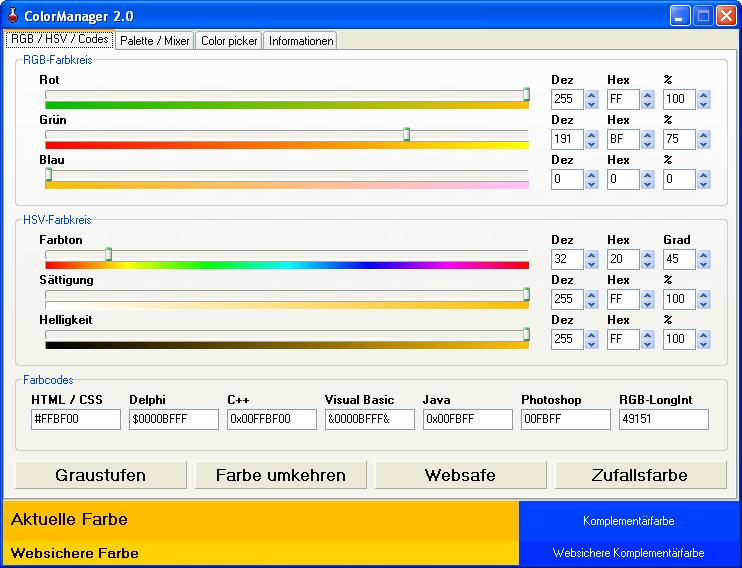
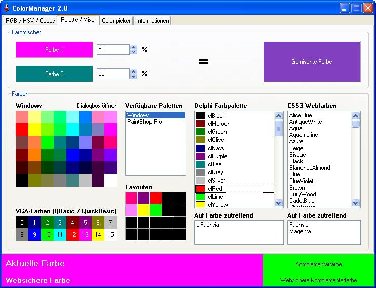
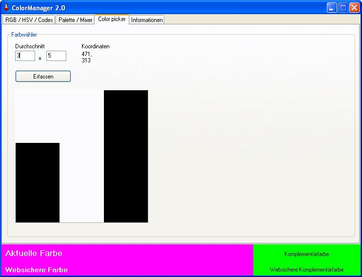

# ColorManager 2.1

The program ColorManager was developed by Daniel Marschall and is used for quick and easy generation of colors. These can be formatted in different formats. This tool is interesting for developers, especially for those who want creating web pages without FrontPage or similar assistance. The program has a large number of features and supports the color circles RGB and HSV. For next versions it is planned to implement support of other color circles.  
  
The new version of ColorManager comes with a lot of new features!  

## Download

[Download for Windows here](https://www.viathinksoft.de/download/3/colormanager_2.1_win32_install.exe)

## Features

- Multilingual (German + English)  
- RGB and HSV color space  
- Color picker with variable average function  
- Settings storage
- CSS web color list
- Color codes: Web, Delphi, C++, VB, Java, Photoshop, LongInt  
- Color mixer with dual variable conditions  
- Random color  
- Complementary color  
- Grayscale (perceptual brightness)  
- Predefined palettes: QuickBasic, Delphi, Webfarben, Paint Shop Pro, Windows  
- System colors  
- 20 Custom, storable colors

## Example screenshots

## Tools required for editing the source code

* Embarcadero Delphi 12 (Community edition available for non-commercial use)

* [Better Translation Manager](https://github.com/andersmelander/better-translation-manager/)
